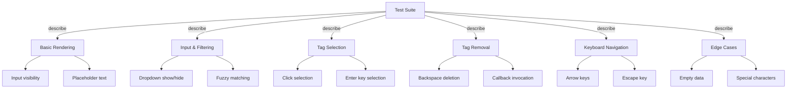

# React UI Testing Know-How

## Overview

Implemented comprehensive test suite for TagsList component using Vitest, react-testing-library, and user-event. Covers fuzzy search, keyboard navigation, state management, and edge cases.

## Environment Setup

### Test Framework Stack

- **Vitest**: Unit/UI testing runner (Bun-compatible)
- **react-testing-library**: DOM queries and user interactions
- **user-event**: Human-like event simulation (keyboard, clicks)
- **jsdom**: DOM environment for tests

### Configuration

```typescript title="vitest.config.ts"
export default defineConfig({
  plugins: [react({ jsxRuntime: "classic" })],
  resolve: {
    alias: {
      "@": path.resolve(__dirname, "./src"),
    },
  },
  test: {
    environment: "jsdom",
    globals: true,
    setupFiles: ["./src/test-setup.ts"],
  },
})
```

### Setup File

```typescript title="src/test-setup.ts"
import '@testing-library/jest-dom'
import { afterEach, vi } from 'vitest'
import { cleanup } from '@testing-library/react'

// Mock scrollIntoView for jsdom
if (!Element.prototype.scrollIntoView) {
  Element.prototype.scrollIntoView = vi.fn()
}

afterEach(() => {
  cleanup()
})
```

> [!Important]
> Always mock browser APIs that jsdom doesn't implement (`scrollIntoView`, etc). Place cleanup in setupFiles to auto-run after each test.

## Test Organization

### Test Categories & Structure



## Testing Patterns

### Test Structure

```typescript {1-13, 15-21}
describe('TagsList Component', () => {
  const mockTags = ['React', 'TypeScript', 'Docker']
  let mockSetSelectedTags: ReturnType<typeof vi.fn>

  beforeEach(() => {
    mockSetSelectedTags = vi.fn()
  })

  const renderComponent = (props = {}) => {
    const defaultProps = {
      tags: mockTags,
      setSelectedTags: mockSetSelectedTags,
    }
    return render(<TagsList {...defaultProps} {...props as any} />)
  }

  const getInput = () => screen.getByRole('textbox') as HTMLInputElement

  // Test cases follow...
})
```

> [!Tip]
> Extract helper functions (`renderComponent`, `getInput`) to reduce boilerplate and maintain DRY principle.

### User Interaction Patterns

#### Setup user-event

```typescript
const user = userEvent.setup()
```

Always initialize before using, not globally in beforeEach (allows cleanup between tests).

#### Type input

```typescript
const input = getInput()
await user.type(input, 'react')
```

Use `await user.type()` not direct value assignment—simulates real keyboard events.

#### Keyboard events

```typescript
await user.keyboard('{Enter}')
await user.keyboard('{Backspace}')
await user.keyboard('{ArrowDown}')
```

Bracket notation for special keys; matches browser key names exactly.

#### Click elements

```typescript
const option = await screen.findByText('React')
await user.click(option)
```

### Query Patterns

#### Accessible queries (preferred)

```typescript
screen.getByRole('textbox')          // Input by role
screen.getByText('React')            // Exact text match
screen.findByText('React')           // Wait for appearance (async)
screen.queryByText('React')          // Check absence (null if not found)
```

> [!Warning]
> `getByRole` > `getByText` > `getByTestId`. Avoid test IDs—they don't reflect actual accessibility.

#### Async queries

```typescript
await waitFor(() => {
  expect(screen.getByText('React')).toBeInTheDocument()
})

// Or simpler with findBy (built-in waitFor)
const element = await screen.findByText('React')
```

## Test Categories

### 1. Basic Rendering

Verify component mounts without errors and renders expected structure.

```typescript
it('should render input field', () => {
  renderComponent()
  expect(getInput()).toBeInTheDocument()
})

it('should display placeholder', () => {
  renderComponent()
  expect(getInput()).toHaveAttribute('placeholder', 'Type to search tags...')
})

it('should not show dropdown initially', () => {
  renderComponent()
  expect(screen.queryByText('React')).not.toBeInTheDocument()
})
```

### 2. Input & Filtering (Fuzzy Search)

Test filtering logic and dropdown visibility.

```typescript
it('should show dropdown when input matches', async () => {
  const user = userEvent.setup()
  renderComponent()

  await user.type(getInput(), 'react')

  await waitFor(() => {
    expect(screen.getByText('React')).toBeInTheDocument()
  })
})

it('should be case insensitive', async () => {
  const user = userEvent.setup()
  renderComponent()

  await user.type(getInput(), 'REACT')

  await waitFor(() => {
    expect(screen.getByText('React')).toBeInTheDocument()
  })
})

it('should hide dropdown when input cleared', async () => {
  const user = userEvent.setup()
  renderComponent()

  const input = getInput()
  await user.type(input, 'react')
  await user.clear(input)

  await waitFor(() => {
    expect(screen.queryByText('React')).not.toBeInTheDocument()
  })
})
```

### 3. Tag Selection

Test selection via click and keyboard, callback invocation, and state updates.

```typescript
it('should select tag on click', async () => {
  const user = userEvent.setup()
  renderComponent()

  const input = getInput()
  await user.type(input, 'react')

  const reactOption = await screen.findByText('React')
  await user.click(reactOption)

  expect(mockSetSelectedTags).toHaveBeenCalledWith(['React'])
})

it('should select tag on Enter key', async () => {
  const user = userEvent.setup()
  renderComponent()

  const input = getInput()
  await user.type(input, 'react')

  await waitFor(() => {
    expect(screen.getByText('React')).toBeInTheDocument()
  })

  await user.keyboard('{Enter}')

  expect(mockSetSelectedTags).toHaveBeenCalledWith(['React'])
})

it('should clear input after selection', async () => {
  const user = userEvent.setup()
  renderComponent()

  const input = getInput()
  await user.type(input, 'react')
  await user.keyboard('{Enter}')

  await waitFor(() => {
    expect(input).toHaveValue('')
  })
})

it('should support multiple selections', async () => {
  const user = userEvent.setup()
  renderComponent()

  const input = getInput()

  await user.type(input, 'react')
  await user.keyboard('{Enter}')

  await user.type(input, 'type')
  await user.keyboard('{Enter}')

  expect(mockSetSelectedTags).toHaveBeenLastCalledWith(['React', 'TypeScript'])
})
```

> [!Important]
> Use `findByText()` after user interaction (includes waitFor). Use `queryByText()` to assert absence. Use `getByText()` only when element definitely exists.

### 4. Keyboard Navigation

Test dropdown highlighting and badge focus management.

```typescript
it('should highlight next item on ArrowDown', async () => {
  const user = userEvent.setup()
  renderComponent()

  const input = getInput()
  await user.type(input, 'r')

  await waitFor(() => {
    const items = screen.queryAllByText(/^(React|Python)$/)
    expect(items.length).toBeGreaterThan(0)
  })

  await user.keyboard('{ArrowDown}')

  // Visual assertion of highlighted state
  const dropdown = screen.getByText('React')?.parentElement
  expect(dropdown).toBeInTheDocument()
})

it('should close dropdown on Escape', async () => {
  const user = userEvent.setup()
  renderComponent()

  const input = getInput()
  await user.type(input, 'react')

  await waitFor(() => {
    expect(screen.getByText('React')).toBeInTheDocument()
  })

  await user.keyboard('{Escape}')

  await waitFor(() => {
    expect(screen.queryByText('React')).not.toBeInTheDocument()
  })
})

it('should remove last tag with Backspace on empty input', async () => {
  const user = userEvent.setup()
  renderComponent()

  const input = getInput()

  await user.type(input, 'react')
  await user.keyboard('{Enter}')

  await user.keyboard('{Backspace}')

  expect(mockSetSelectedTags).toHaveBeenCalledWith([])
})
```

### 5. Edge Cases

```typescript
it('should handle empty tags array', () => {
  renderComponent({ tags: [] })
  expect(getInput()).toBeInTheDocument()
})

it('should handle special characters in tags', async () => {
  const specialTags = ['C++', 'C#', 'Node.js']
  const user = userEvent.setup()
  renderComponent({ tags: specialTags })

  const input = getInput()
  await user.type(input, 'c')

  await waitFor(() => {
    const cppExists = screen.queryByText('C++') !== null
    const csharpExists = screen.queryByText('C#') !== null
    expect(cppExists || csharpExists).toBe(true)
  })
})

it('should preserve input value when closing with Escape', async () => {
  const user = userEvent.setup()
  renderComponent()

  const input = getInput()
  await user.type(input, 'react')

  await user.keyboard('{Escape}')

  expect(input).toHaveValue('react')
})
```

## Key Insights

### State & Props Testing

- Mock callback props with `vi.fn()` to verify invocation count and arguments
- Use `toHaveBeenCalledWith()` and `toHaveBeenLastCalledWith()` for exact assertions
- Reset mocks in `beforeEach()` to prevent test pollution

### Async Patterns

| Pattern | When to Use |
|---------|------------|
| `await waitFor(() => {...})` | Wait for DOM updates after state changes |
| `await screen.findByText()` | Same as `waitFor` + `getByText` combined |
| `screen.queryByText()` | Check absence (immediate, no wait) |
| `user.type()`, `user.click()` | Always await user interactions |

> [!Tip]
> Prefer `findByText()` over `waitFor() + getByText()` for cleaner code.

### Common Pitfalls

- Forgetting `await` on user-event calls → tests pass but don't actually simulate
- Using `getByText()` before interaction → throws error if element not yet rendered
- Not resetting mocks between tests → assertions fail unexpectedly
- Querying by test ID instead of accessible roles → misses real accessibility issues

> [!Attention]
> Always use `userEvent.setup()` per test, not globally. This ensures proper cleanup of event simulation state.

## Known Issues & Solutions

### jsdom Environment Quirks

jsdom doesn't implement all browser APIs. Common issues:

| Issue | Solution |
|-------|----------|
| `scrollIntoView is not a function` | Mock in setup file: `Element.prototype.scrollIntoView = vi.fn()` |
| `document is not defined` | Ensure setupFiles runs after jsdom initialization |
| user-event compatibility | Use jsdom (not happy-dom) for full event simulation |

> [!Attention]
> vitest + jsdom + user-event@14.6.1 requires careful version alignment. If tests fail with document errors, verify:
> - vitest.config.ts has `environment: "jsdom"` (not happy-dom)
> - test-setup.ts is listed in setupFiles
> - All required dependencies are installed

### Timing Issues

Tests with `waitFor` may timeout if:
- Component doesn't re-render after state change
- Event handlers aren't properly wired
- Async operations aren't awaited

**Solution**: Check component event handler implementation and ensure `setSelectedTags()` is actually called.

## Running Tests

```bash
bun test                      # Run all tests
bun test src/tags-list.test   # Run specific file
bun test --watch              # Watch mode
```

Package.json script:
```json
"test": "vitest"
```

## Benefits of This Approach

- Validates component behavior from user perspective, not implementation
- Catches regressions in keyboard navigation and accessibility early
- Documents expected behavior through test cases
- Enables confident refactoring without breaking functionality
- Tests are maintainable and readable for future developers

## Related Components

Tags-list component implementation: `/src/tags-list.tsx`
- Fuzzy match algorithm (lines 37-51)
- Keyboard event handlers (lines 97-243)
- Focus management with badge refs (lines 142-177)
