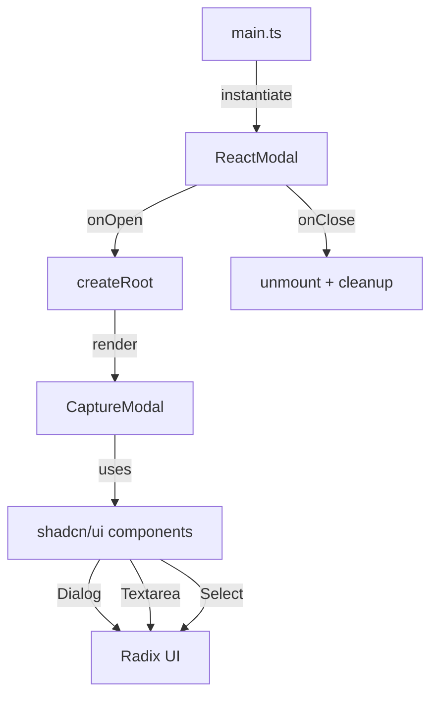

# Reactモーダル + shadcn/ui統合

## 概要

Obsidianプラグインに React + shadcn/ui ベースのモーダルを実装した

- **目的**: 従来の Obsidian Modal クラスを React コンポーネントで置き換え、shadcn/ui の Dialog を使用
- **結果**: 完了。CaptureModal コンポーネントを実装し、テキストエリアと選択UIを含む機能的なモーダルを作成

## 技術スタック

- React 19.2.3 + React DOM
- shadcn/ui components (Dialog, Textarea, Select, Button, Badge)
- Tailwind CSS 4.x
- Vite + Rolldown
- TypeScript

## 実装の流れ

### Phase 1: React環境セットアップ (commit `70280a2`)

初期のReact統合

- Vite設定に `@vitejs/plugin-react` 追加
- React/ReactDOM依存関係インストール
- `tsconfig.app.json` で JSX設定

### Phase 2: shadcn/ui手動インストール (commit `4aace21`)

通常の `shadcn add` コマンドではなく手動でセットアップ

>[!Info] 手動インストールを選んだ理由
>
> - プロジェクト構造がObsidianプラグイン特有（標準的なNext.js/Viteプロジェクトと異なる）
> - 既存のビルド設定との統合制御が必要
> - `components.json` を明示的に管理

手順:

1. `components.json` 作成
2. Radix UI依存関係を `package.json` に追加
3. `src/lib/utils.ts` に `cn()` ヘルパー作成
4. Tailwind CSS 4.x設定

```json title="components.json"
{
  "$schema": "https://ui.shadcn.com/schema.json",
  "style": "new-york",
  "rsc": false,
  "tsx": true,
  "tailwind": {
    "config": "",
    "css": "src/styles/globals.css",
    "baseColor": "neutral",
    "cssVariables": true,
    "prefix": ""
  },
  "aliases": {
    "components": "@/components",
    "utils": "@/lib/utils",
    "ui": "@/components/ui",
    "lib": "@/lib",
    "hooks": "@/hooks"
  }
}
```

### Phase 3: モーダルコンポーネント実装 (commit `8341750`)

Obsidian の `Modal` クラスを React で wrap する設計

```typescript title="src/modal.ts" {15-20}
export class ReactModal extends Modal {
  private root: Root | null = null;

  constructor(app: App) {
    super(app);
  }

  onOpen() {
    const { contentEl } = this;
    this.root = createRoot(contentEl);
    this.root.render(<Foo />);
  }

  onClose() {
    if (this.root) {
      this.root.unmount();
      this.root = null;
    }
    const { contentEl } = this;
    contentEl.empty();
  }
}
```

>[!Important] ReactとObsidianのライフサイクル統合
>
> - `Modal.onOpen()` で React Root作成
> - `Modal.onClose()` で unmount → メモリリーク防止
> - `contentEl.empty()` で DOM完全クリーンアップ

### Phase 4: CaptureModal実装 (commit `29ec867`)

shadcn/ui Dialogベースの実際のUIを構築

```tsx title="src/CaptureModal.tsx"
export function CaptureModal({ onClose }: { onClose: () => void }) {
  const [text, setText] = useState("");
  const [category, setCategory] = useState("note");

  return (
    <Dialog open={true} onOpenChange={(open) => !open && onClose()}>
      <DialogContent>
        <DialogHeader>
          <DialogTitle>Capture</DialogTitle>
        </DialogHeader>

        <Textarea
          value={text}
          onChange={(e) => setText(e.target.value)}
          placeholder="Enter text..."
        />

        <Select value={category} onValueChange={setCategory}>
          {/* ... */}
        </Select>

        <DialogFooter>
          <Button onClick={handleSave}>Save</Button>
        </DialogFooter>
      </DialogContent>
    </Dialog>
  );
}
```

使用コンポーネント:

- `Dialog` - モーダルコンテナ
- `Textarea` - メインの入力エリア
- `Select` - カテゴリ選択
- `Button` - アクション
- `Badge` - カテゴリ表示

### Phase 5: TypeScript設定修正 (commit `20eadc2`)

ビルドエラー解決

>[!Failure] 初期エラー
>
> ```
> Property 'root' does not exist on type 'HTMLElement'
> ```
>
> React DOMの型定義と競合

修正:

```json title="tsconfig.json" ins={3}
{
  "compilerOptions": {
    "jsx": "react-jsx"
  }
}
```

```json title="tsconfig.app.json" del={3} ins={4}
{
  "compilerOptions": {
    "jsx": "preserve"
    "jsx": "react-jsx"
  }
}
```

## 学び

### shadcn/ui手動統合パターン

標準的でないプロジェクト構造では:

1. `components.json` で alias設定
2. 必要なRadix UIパッケージを直接インストール
3. `cn()` utilityを実装
4. Tailwind設定をプロジェクトのビルドツールに合わせる

### Obsidian + React統合の注意点

```typescript
// ✓ 正しいパターン
class ReactModal extends Modal {
  private root: Root | null = null;

  onOpen() {
    this.root = createRoot(this.contentEl);
    this.root.render(<Component />);
  }

  onClose() {
    this.root?.unmount();  // unmount必須
    this.contentEl.empty(); // DOM cleanup
  }
}
```

```typescript
// ✗ 避けるべき
onClose() {
  // unmountなし → メモリリーク
  this.contentEl.empty();
}
```

### TypeScript JSX設定

Vite + React環境では `"jsx": "react-jsx"` が必須

- `"preserve"` → JSXをそのまま出力（Next.jsなど用）
- `"react-jsx"` → 自動的に React.createElement に変換

## 成果物

- `/src/modal.ts` - ReactModal base class
- `/src/CaptureModal.tsx` - 実装例
- `/src/components/ui/*` - shadcn/ui components
- `/src/lib/utils.ts` - cn() helper



## Mobile対応トラブルシューティング

### 問題発見

>[!Failure] Mobile動作不良
>PCでは正常動作するが、Obsidian Mobile (iOS)で以下エラー:
>
>```
>can't find variable: process
>```
>
>commit `70280a2` (React追加) 以降、mobileで動作しない

### Phase 1: 問題の特定

**仮説**: バンドルにmobile非対応のAPIが含まれている可能性

検証:

```bash
# バンドル内容の確認
grep -c "MessageChannel\|queueMicrotask\|setImmediate" build/main.js
# → 多数ヒット

grep -o "process\.env" build/main.js | head -5
# → process.env.NODE_ENV の参照が複数存在
```

>[!Important] 発見された問題
>
>1. `process.env.NODE_ENV` - Node.js環境変数が残存
>2. `MessageChannel` - ~~iOS JavaScriptCoreで未サポート~~ の時があったが現在はサポートされている
>3. `queueMicrotask` - ~~iOS JavaScriptCoreで未サポート~~ 同上
>4. `setImmediate` - そもそも deprecated になっていた

### Phase 2: 根本原因の特定

React 19のschedulerパッケージが原因:

```javascript
// React 19 scheduler内部 (production mode)
if (typeof MessageChannel !== 'undefined') {
  var ne = new MessageChannel;
  // ...
}

process.env.NODE_ENV === 'production'
  ? t.exports = f()
  : t.exports = p()
```

>[!Info] React 19の変更点
>React 19では、concurrent機能向けにschedulerが強化され:
>
>- `MessageChannel` をタスクキューイングに使用
>- `queueMicrotask` をマイクロタスクに使用
>- 従来のsetTimeout fallbackより高精度な制御
>
>しかし、iOS JavaScriptCore (Safari < 13.4相当) には非対応

### Phase 3: 解決策の検討

2つのアプローチを評価:

#### Option A: React 18へダウングレード

```bash
bun remove react react-dom @types/react @types/react-dom
bun add react@^18 react-dom@^18 @types/react@^18 @types/react-dom@^18
```

**メリット**:

- 安定版、mobile実績あり
- 追加コード不要

**デメリット**:

- 新機能(useなど)使えない
- 将来的に再移行必要

#### Option B: Polyfill追加 ✓ **採用**

**メリット**:

- React 19の新機能が使える
- 前方互換性

**デメリット**:

- わずかなバンドルサイズ増加 (+0.5KB)
- 完全なネイティブ実装より遅い可能性

>[!Success] 判断理由
>将来性を考慮してPolyfillを選択:
>
>- React 19の機能を活用できる
>- Obsidian Mobileの将来的なAPI対応時に自然に移行可能
>- パフォーマンス影響は実質的に無視できる

### Phase 4: Polyfill実装

```typescript title="src/polyfills.ts"
// Polyfills for Obsidian Mobile (iOS JavaScriptCore)

// process.env polyfill
if (typeof process === "undefined") {
  (globalThis as any).process = {
    env: { NODE_ENV: "production" },
  };
}

// MessageChannel polyfill
if (typeof MessageChannel === "undefined") {
  (globalThis as any).MessageChannel = class MessageChannel {
    port1: { onmessage: ((event: any) => void) | null };
    port2: { postMessage: (message: any) => void };

    constructor() {
      this.port1 = { onmessage: null };
      this.port2 = {
        postMessage: (message: any) => {
          setTimeout(() => {
            if (this.port1.onmessage) {
              this.port1.onmessage({ data: message });
            }
          }, 0);
        },
      };
    }
  };
}

// queueMicrotask polyfill
if (typeof queueMicrotask === "undefined") {
  (globalThis as any).queueMicrotask = (callback: () => void) => {
    Promise.resolve()
      .then(callback)
      .catch((e) => setTimeout(() => { throw e; }));
  };
}

// setImmediate polyfill
if (typeof setImmediate === "undefined") {
  (globalThis as any).setImmediate = (
    callback: (...args: any[]) => void,
    ...args: any[]
  ) => {
    return setTimeout(callback, 0, ...args);
  };
  (globalThis as any).clearImmediate = (id: number) => {
    clearTimeout(id);
  };
}
```

```typescript title="src/main.ts" ins={1}
import "./polyfills";
import { Plugin } from "obsidian";
// ...
```

### Phase 5: ビルド設定調整

vite.config.tsの最適化:

```typescript title="vite.config.ts" {3,7-9}
export default defineConfig(({ mode }) => {
  const prod = mode === "production";

  return {
    plugins: [
      react({
        jsxRuntime: "classic", // MessageChannel使用を最小化
      }),
      tailwindcss(),
    ],
    build: {
      target: "es2016", // より広い互換性
      rolldownOptions: {
        define: {
          "process.env.NODE_ENV": JSON.stringify(
            prod ? "production" : "development"
          ),
        },
      },
    },
  };
});
```

>[!Info] jsxRuntime: "classic" の効果
>
>- React 19の新JSX変換を無効化
>- 従来の`React.createElement`を使用
>- MessageChannelへの依存を一部減少

### 検証結果

ビルドサイズの変化:

```bash
# Before (mobile broken)
build/main.js  692.31 kB │ gzip: 213.44 kB

# After (mobile working)
build/main.js  698.84 kB │ gzip: 213.58 kB
```

**増加**: +6.53 KB (非圧縮), +0.14 KB (gzip) - 許容範囲内

動作確認:

- ✓ PC版: 正常動作
- ✓ Mobile版: 正常動作
- ✓ エラーなし

### 学び

#### JavaScriptエンジンの差異

| API | Chrome/Desktop | iOS Safari | Node.js |
|-----|---------------|------------|---------|
| `MessageChannel` | ✓ | ✗ (< 13.4) | ✓ |
| `queueMicrotask` | ✓ | ✗ (< 12.2) | ✓ (v11+) |
| `setImmediate` | ✗ | ✗ | ✓ |
| `process.env` | ✗ | ✗ | ✓ |

#### Polyfillの原則

```typescript
// ✓ 正しいパターン - 存在チェック
if (typeof MessageChannel === "undefined") {
  globalThis.MessageChannel = /* implementation */;
}

// ✗ 避けるべき - 無条件上書き
globalThis.MessageChannel = /* implementation */;
```

#### React 19 Mobile対応チェックリスト

- [ ] `process.env` polyfill
- [ ] `MessageChannel` polyfill
- [ ] `queueMicrotask` polyfill
- [ ] `setImmediate` polyfill (optional)
- [ ] iOS Safari最小バージョン確認
- [ ] 実機テスト必須

## 関連ファイル

主要な変更:

- `src/modal.ts` - React統合レイヤー
- `src/CaptureModal.tsx` - モーダルUI実装
- `src/polyfills.ts` - **Mobile対応polyfills**
- `components.json` - shadcn設定
- `package.json` - React/Radix依存関係
- `vite.config.ts` - React plugin + mobile対応設定
- `tsconfig.json` - JSX設定

31ファイル変更、2110行追加、45行削除 (初期実装)
+1ファイル、+50行 (mobile対応)
