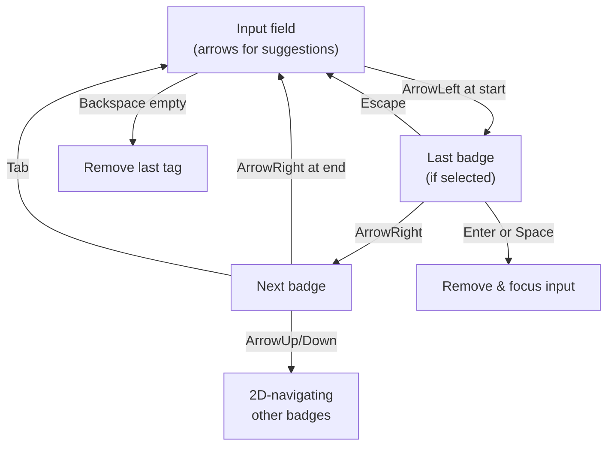

# TagsList Keyboard Navigation Implementation

## 概要

TagsListコンポーネントに包括的なキーボードナビゲーション機能を実装。入力フィールド、サジェスチョンドロップダウン、選択済みタグバッジ間のシームレスなフォーカス移動を実現。

- 目的: アクセシビリティを考慮した完全なキーボード操作対応
- 結果: 成功 - 複雑なフォーカス状態管理パターンを確立

## 実装内容

### 1. フォーカス状態管理

新規state追加:
- `focusedBadgeIndex`: 現在フォーカス中のバッジインデックス（null=なし）
- `badgeRefs`: バッジDOM要素への参照配列

> [!Info]
> 複数の独立したフォーカスターゲット（入力フィールド、複数バッジ、ドロップダウン）を持つコンポーネントでは、state側でアクティブなターゲットを明確に記録することが重要

### 2. 入力フィールド内のキーボード操作

#### ArrowLeft: 左端からバッジへ遷移

```typescript
if (e.key === 'ArrowLeft' && inputValue === '' && e.currentTarget.selectionStart === 0 && selectedTags.length > 0) {
  e.preventDefault()
  setFocusedBadgeIndex(selectedTags.length - 1)
  badgeRefs.current[selectedTags.length - 1]?.focus()
}
```

> [!Tip]
> 条件チェック: `inputValue === ''` と `selectionStart === 0` を両方確認することで、空入力時かつカーソルが最左端の時のみ遷移。これによりテキスト編集中の意図しないナビゲーション移動を防止

#### Backspace: 空入力時に最後のタグを削除

```typescript
if (e.key === 'Backspace' && inputValue === '' && selectedTags.length > 0) {
  const x = selectedTags[selectedTags.length - 1]
  if (x) {
    removeTag(x)
  }
}
```

#### ArrowUp/ArrowDown: サジェスチョンハイライト制御

通常の上下キーはサジェスチョンリスト内の選択肢ハイライト移動に使用

### 3. バッジのキーボード操作

#### 水平移動（ArrowLeft/ArrowRight）

```typescript
case 'ArrowLeft':
  if (index > 0) {
    setFocusedBadgeIndex(index - 1)
    badgeRefs.current[index - 1]?.focus()
  }
  break
case 'ArrowRight':
  if (index < selectedTags.length - 1) {
    setFocusedBadgeIndex(index + 1)
    badgeRefs.current[index + 1]?.focus()
  } else {
    // Move focus back to input when at the last badge
    setFocusedBadgeIndex(null)
    inputRef.current?.focus()
  }
  break
```

> [!Success]
> ArrowRight が最後のバッジに達するとバッジから入力フィールドへ自動移動。ユーザーがタブキーを押さずに自然な流れで操作継続可能

#### 垂直移動（ArrowUp/ArrowDown）- 複雑な2D ナビゲーション

```typescript
const findClosestBadgeInDirection = (currentIndex: number, direction: 'up' | 'down'): number | null => {
  const currentBadge = badgeRefs.current[currentIndex]
  if (!currentBadge) return null

  const currentRect = currentBadge.getBoundingClientRect()
  const currentY = currentRect.top
  const currentX = currentRect.left + currentRect.width / 2

  let closestIndex: number | null = null
  let closestDistance = Infinity

  for (let i = 0; i < selectedTags.length; i++) {
    if (i === currentIndex) continue

    const badge = badgeRefs.current[i]
    if (!badge) continue

    const rect = badge.getBoundingClientRect()
    const badgeY = rect.top
    const badgeX = rect.left + rect.width / 2

    // Check if badge is in the desired direction
    if (direction === 'up' && badgeY >= currentY) continue
    if (direction === 'down' && badgeY <= currentY) continue

    // Calculate distance
    const distance = Math.sqrt(Math.pow(badgeX - currentX, 2) + Math.pow(badgeY - currentY, 2))

    if (distance < closestDistance) {
      closestDistance = distance
      closestIndex = i
    }
  }

  return closestIndex
}
```

> [!Important]
> ラッピング（複数行表示）されたバッジに対応するため、方向性チェック（`badgeY >= currentY` / `badgeY <= currentY`）＋ユークリッド距離による最近傍検索を採用。これはCSS flexwrap環境で柔軟なバッジレイアウトに対応

#### 削除操作（Enter / Space）

```typescript
case 'Enter':
case ' ':
  e.preventDefault()
  const tagToRemove = selectedTags[index]
  if (tagToRemove) {
    removeTag(tagToRemove)
  }
  // Focus input after removal
  inputRef.current?.focus()
  break
```

削除後は入力フィールドへ自動フォーカス遷移

#### Tab キー処理

```typescript
case 'Tab':
  if (!e.shiftKey) {
    // Tab without Shift: move to input
    e.preventDefault()
    setFocusedBadgeIndex(null)
    inputRef.current?.focus()
  } else {
    // Shift+Tab: allow default behavior to move to previous element
    setFocusedBadgeIndex(null)
  }
  break
```

> [!Tip]
> Shift+Tab は標準的なタブフロー（前の要素へ遷移）に委譲。Tabのみはキャプチャして入力フィールドへ明示的にフォーカス。これによりスクリーンリーダーやキーボードナビゲーション支援ツールとの互換性を維持

#### Escape: フォーカス解除

```typescript
case 'Escape':
  e.preventDefault()
  setFocusedBadgeIndex(null)
  inputRef.current?.focus()
  break
```

### 4. ビジュアル フィードバック

バッジのfocusedstate表示:

```tsx
className={`flex items-center gap-1 cursor-pointer hover:bg-secondary/80 ${
  focusedBadgeIndex === index ? 'ring-2 ring-ring' : ''
}`}
```

Ring フォーカスインジケータ（Tailwind `ring-2 ring-ring`）で視覚的にアクティブなバッジを表示

### 5. Ref管理とクリーンアップ

```typescript
useEffect(() => {
  badgeRefs.current = badgeRefs.current.slice(0, selectedTags.length)
}, [selectedTags])
```

> [!Attention]
> selectedTags削除時にref配列サイズをトリム。参照不一致によるバグ（存在しないバッジへのフォーカス試行）を防止

## 設計上のキーインサイト

### フォーカス遷移フロー



### 主要な決定

1. **2D ナビゲーション採用**: 単純な線形リストでなく、ラッピング対応のため最近傍距離検索を使用

2. **フォーカス遷移時の入力フィールド自動フォーカス**: バッジ削除後や移動終了時にキャレット位置を入力フィールドに戻す。ユーザーは複数タグ選択→タグ調整→追加入力という連続的な操作フローを円滑に実行可能

3. **Ref配列の明示的管理**: React の useRef+useState ハイブリッドで DOM 要素への信頼できる参照を維持。フォーカス移動時のDOM操作（`.focus()`）を確実に実行

4. **selectionStart チェック**: キャレット位置を検査してテキスト編集中の キー入力をフィルタリング。UXの落とし穴を事前回避

## Tailwind CSS 追加

styles.css に新規 utility class 追加:

```css
.ring-2 {
  --tw-ring-shadow: var(--tw-ring-inset,) 0 0 0 calc(2px + var(--tw-ring-offset-width)) var(--tw-ring-color, currentcolor);
  box-shadow: var(--tw-inset-shadow), var(--tw-inset-ring-shadow), var(--tw-ring-offset-shadow), var(--tw-ring-shadow), var(--tw-shadow);
}
.ring-ring {
  --tw-ring-color: var(--ring);
}
```

フォーカスリングのスタイル定義

## 学び

- **複雑なフォーカス管理**: 複数ターゲット＋動的配列のシナリオでは、単一の "activeElement" ではなく明示的な state（focusedBadgeIndex）で意図を記録することが保守性向上

- **2D キーボード ナビゲーション**: ラッピング要素群への上下移動は単純なインデックス操作ではなく、実際の画面座標ベースの最近傍検索が必要。getBoundingClientRect() + ユークリッド距離により flexible なレイアウトに対応

- **フロー継続性**: 削除・移動後の自動フォーカス遷移によりユーザーが手作業でフォーカスを戻す必要がなくなり、タイピング流（"型 → 修正 → 続行"）を実現

- **Ref 配列同期**: useEffect で ref 配列サイズを明示的に管理しないと、stale ref 参照やインデックス不一致バグが発生する可能性
